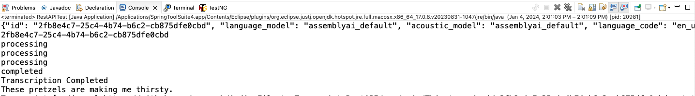

# Audio-File-to-Transcript-RestAPI 🎙️➡️📝

## Introduction 🌟
Welcome to `Audio-File-to-Transcript-RestAPI`! This repository is all about converting spoken words in your audio files into written text using AssemblyAI's powerful speech recognition. Whether you're handling podcasts, interviews, or lectures, this API is here to streamline the transcription process.

## What it Does 🚀
Simply put, you send over an audio file 🎵, and get back a neatly transcribed text 📄. It's perfect for developers looking to integrate transcription capabilities into their applications or for anyone who needs quick and accurate transcriptions.

## Technology 🧠
Leveraging AssemblyAI's robust API, this project promises high accuracy and supports various audio formats, making your audio-to-text experience smoother and more reliable.

## Screenshot 📸
Here's what the Audio-File-to-Transcript looks like in action:

Happy Transcribing! 🎉
